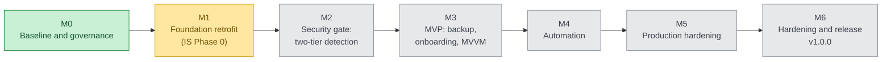

# App Lock (Android)

[](https://github.com/PyrosCat/App_lock/actions/workflows/ci.yml)

Android app locker: PIN/biometric gating of protected apps, encrypted media vault, and
intruder-selfie capture — local-only, encrypted at rest.

**2026-07-19: the project was re-baselined** onto a new authoritative documentation set
(SRS 375 FRs, NFR 171 requirements, TAS, SDS, Implementation Strategy). See
[docs/process/MIGRATION_ASSESSMENT.md](docs/process/MIGRATION_ASSESSMENT.md) for the full
transition analysis and [docs/process/rtm/rtm.csv](docs/process/rtm/RTM.md) for per-requirement
status.

## Status

Implemented and E2E-validated (pre-rebaseline Phases 1–3, commits `61f1db4`…`1dc9e25`):
core locking (accessibility detection, PIN + biometric auth, relock policies), security
hardening (Argon2id, SQLCipher, lockout, watchdog, opt-in uninstall protection), encrypted
vault, and intruder selfie.

Lifecycle position under the new Implementation Strategy (phases 0–6):

| IS Phase | Scope | Status |
|---|---|---|
| 0 Foundation | CI/CD, static analysis, Hilt DI, build variants, docs governance | **← current** (migration M1; WP1–WP5 done, WP6 next) |
| 1 Core Security Platform | Auth, crypto, lock engine, sessions | Built; formal gate review pending (M2) |
| 2 Core App Features (MVP) | Protected apps ✓, vault ✓, settings ◐, backup ✗, onboarding ✗ | Partial (M3) |
| 3 Automation | Schedules, Wi-Fi/Bluetooth/location rules, rule engine | Planned (M4; design input in docs/process/PHASE4_PLAN.md) |
| 4 Production Hardening | Observability, resilience, data lifecycle, scalability | Planned (M5) |
| 5–6 Security Hardening & Release | Verification campaigns, release governance, v1.0.0 | Planned (M6) |

### Roadmap — where the project stands

Execution runs on the migration path **M0 → M6** (live status: [ROADMAP.md](docs/process/ROADMAP.md);
baseline analysis: [MIGRATION_ASSESSMENT.md](docs/process/MIGRATION_ASSESSMENT.md));
M1 (foundation retrofit = IS Phase 0) is broken into work packages WP1–WP8
([M1_PLAN.md](docs/process/M1_PLAN.md)).

**Legend:** 🟢 done · 🟡 current · 🔵 next · ⚪ planned.

The milestone spine, **M0 → M6**:



**M1 (current)** breaks into eight work packages — WP1–WP5 done, WP6 next:

```mermaid
flowchart LR
    classDef done fill:#c9efd4,stroke:#248a3d,color:#14532d
    classDef next fill:#bde3ec,stroke:#1592a8,color:#0c4a56
    classDef todo fill:#e6e8ea,stroke:#8a9199,color:#3a4149

    WP1["WP1<br/>CI freeze"]:::done
    WP2["WP2<br/>Device harness"]:::done
    WP3["WP3<br/>Static analysis"]:::done
    WP4["WP4<br/>Build variants"]:::done
    WP5["WP5<br/>Hilt migration"]:::done
    WP6["WP6<br/>Package realign"]:::next
    WP7["WP7<br/>DB fail-safe"]:::todo
    WP8["WP8<br/>Instrumentation and gate"]:::todo

    WP1 --> WP2 --> WP3 --> WP4 --> WP5 --> WP6 --> WP7 --> WP8
```



**WP5 (Hilt) is complete** — 71 unit tests, R8 release build clean, zero `Graph` references, and the
on-device gating-regression gate is **green on both real hardware (Moto G 2025, 2/2) and the NucBox
API 26/29/33/35 emulator matrix** — ADR-015 validated. WP6 (package realignment) is next.

Pre-rebaseline **Phases 1–3 are already built and E2E-validated** (see above) — they underlie the
M1 foundation and get their formal security-gate review in M2.

## Documentation map

| Path | Contents |
|---|---|
| `docs/v1.0.0/` | **Active baseline (ADR-019):** client-approved 1.0.0 specs — SRS, NFR, SDS, DDS, Threat Model, UI/UX + self-contained build pipeline (`source/`) |
| `docs/v2.0.0/` | 2.0.0 target: the full client-received spec set — SRS 1–18 (FR-001..375), NFR, TAS, SDS, DDS, TSP, TM |
| `docs/architecture/adr/` | Architecture Decision Records — ADR-001..019 (incl. the ADR-013 lineage) |
| `docs/process/` | Implementation Strategy, migration assessment, plans, ROADMAP, RTM, risk register |
| `docs/testing/` | Test plans and validation campaign records |
| `docs/archive/` | Superseded docs — **note the FR-226..250 renumbering notice** |

`changelog.txt` (repo root) carries human-readable change detail; commit subjects stay one line.

## Getting started

1. Install [Android Studio](https://developer.android.com/studio) (bundles JDK + Android SDK).
2. Open this folder in Android Studio and let Gradle sync (Gradle 8.10+ / AGP 8.7).
3. Run the `app` configuration on a device or emulator — minSdk 26 / targetSdk 35 (ADR-014).

First-run flow: create a PIN (Argon2id hash in EncryptedSharedPreferences) → enable the
**App Lock protection** accessibility service → toggle apps to protect → opening a protected
app shows the lock screen (PIN or biometrics). Optional: intruder selfie (Settings, needs
CAMERA) and the encrypted vault (photo-library icon in the app list).

## Build variants

WP4 (M1) added an `environment` flavor dimension — `dev` / `qa` / `staging` / `prod` — crossed
with the `debug`/`release` build types (8 variants; ADR-017). `prod` is the default and keeps
applicationId `com.applock`; `dev`/`qa`/`staging` get a matching applicationId + versionName
suffix so they install **side-by-side** with prod. Each variant exposes `BuildConfig.ENVIRONMENT`,
`BuildConfig.SCHEMA_VERSION`, and `BuildConfig.BUILD_TIME`.

```bash
./gradlew assembleProdRelease            # shipping build (R8/minified)
./gradlew assembleDevDebug               # day-to-day dev build
./gradlew assembleDebug assembleRelease  # all 8 variants
```

`BUILD_TIME` is injected via the absent-safe Gradle property `-PbuildTime=<iso8601>` (defaults to
`unknown`); CI passes the real UTC time. That same property path is the sanctioned route for any
future secret — **never hard-code secrets** (ADR-017, FR-227). Dependency versions live in the
`gradle/libs.versions.toml` catalog; Dependabot proposes weekly updates
(`.github/dependabot.yml`), and CI archives a dependency/license inventory.

## Architecture (as built)

```
AccessibilityService (AppDetectionService)          ProtectionWatchdogService
        │  foreground package changed               (FGS: alerts if the a11y
        ▼                                            permission is revoked)
ApplicationLockEngine ──── logs ──► SecurityEventDao (Room + SQLCipher)
        │                    └────► IntruderCaptureManager (threshold → front-camera
        │                           JPEG → EncryptedFile + event row + notification)
        ├── LockPolicyManager   — is this package protected? (in-memory cache over Room)
        ├── LockSessionManager  — valid unlock session? (IMMEDIATE / GRACE_10S / SCREEN_OFF)
        ├── LockoutManager      — brute-force protection (persisted counters, FR-174)
        ▼  requires auth
LockScreenActivity (Compose PIN pad + BiometricPrompt + lockout countdown)
        ▼
CredentialRepository (EncryptedSharedPreferences + Argon2id;
                      legacy PBKDF2 hashes upgrade on first verify)

Vault: SAF import → AES-256-GCM EncryptedFile blobs (UUID names) + SQLCipher index rows;
byte-identical export; secure delete. Self-gate re-locks the app's own UI on resume (FR-108).
```

Security notes: Argon2id (BouncyCastle, OWASP params m=19 MiB t=2 p=1); SQLCipher passphrase
random + Keystore-wrapped; Phase-1 plaintext DBs migrate by read-and-reinsert (see ADR-012 —
`sqlcipher_export` silently fails in this integration); FLAG_SECURE in release builds;
uninstall protection is opt-in device admin.

Migration status (see ADRs): `core/Graph.kt` service locator → Hilt **done** (ADR-015, M1/WP5);
destructive-migration fallback removal pending (ADR-007, M1/WP7); root/tamper detection and
pattern/knock auth not yet implemented (RTM rows FR-167..170, FR-004/005).
