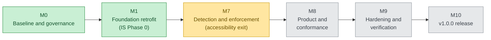
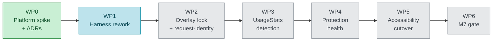

# App Lock (Android)

[](https://github.com/PyrosCat/App_lock/actions/workflows/ci.yml)

Android app locker: PIN/biometric gating of protected apps, encrypted media vault, and
intruder-selfie capture — local-only, encrypted at rest.

**2026-07-19: the project was re-baselined** onto a new authoritative documentation set
(SRS 375 FRs, NFR 171 requirements, TAS, SDS, Implementation Strategy). See
[docs/process/MIGRATION_ASSESSMENT.md](docs/process/MIGRATION_ASSESSMENT.md) for the full
transition analysis and [docs/process/rtm/rtm.csv](docs/process/rtm/RTM.md) for per-requirement
status.

## Status

Implemented and E2E-validated (pre-rebaseline Phases 1–3, commits `61f1db4`…`1dc9e25`):
core locking (accessibility detection, PIN + biometric auth, relock policies), security
hardening (Argon2id, SQLCipher, lockout, watchdog, opt-in uninstall protection), encrypted
vault, and intruder selfie.

Lifecycle position after the **v1.0.0 / v2.0.0 split** (ADR-019, 2026-08-14): the client-approved
1.0.0 spec (`docs/v1.0.0/`) is the active baseline; the full spec (`docs/v2.0.0/`) is the 2.0.0
target. Detection scope is fixed by ADR-013B — Usage Access + a mandatory system overlay, **no
accessibility service in 1.0.0**.

**Legend:** 🟢 done · 🟡 current · ⚪ planned.

| Milestone | Line | Status |
|---|---|---|
| M0 Baseline & governance | foundation | 🟢 Done |
| M1 Foundation retrofit (IS Phase 0) | foundation | 🟢 Done (2026-08-25) — exit granted, tag `M1_Exit` |
| M7 Detection & enforcement replacement | 1.0.0 | 🟡 Current — the accessibility exit (Usage Access + overlay); **WP0 complete (2026-08-30)** — ADR-020/021 Accepted, targetSdk 36 (D0); **WP1 (harness rework) next** |
| M8 Product & conformance | 1.0.0 | ⚪ Planned — UI/UX surfaces; vault/intruder removed from the 1.0.0 line |
| M9 Hardening & verification | 1.0.0 | ⚪ Planned |
| M10 Release | 1.0.0 | ⚪ Planned — signed v1.0.0 |
| M2–M6 | 2.0.0 (deferred) | ⚪ Frozen — the 2.0.0 lineage: vault, intruder, automation, observability, … |

### Roadmap — where the project stands

Live status: [ROADMAP.md](docs/process/ROADMAP.md); baseline analysis (frozen snapshot):
[MIGRATION_ASSESSMENT.md](docs/process/MIGRATION_ASSESSMENT.md). The **1.0.0 line is M0–M1 → M7–M10**
(ADR-019 re-cut); the earlier M2–M6 scope is frozen as the deferred 2.0.0 lineage. **M1 (foundation
retrofit) closed 2026-08-25** ([M1_PLAN.md](docs/process/M1_PLAN.md), WP1–WP8 all done); **M7 is now
the current milestone** ([M7_PLAN.md](docs/process/M7_PLAN.md)).

The 1.0.0 milestone spine:



The deferred **M2–M6** scope (vault, intruder capture, automation, observability, …) becomes the **2.0.0** lineage.

**M1 (done, 2026-08-25)** delivered eight work packages — WP1–WP8 all complete:

```mermaid
flowchart LR
    classDef done fill:#c9efd4,stroke:#248a3d,color:#14532d
    classDef next fill:#bde3ec,stroke:#1592a8,color:#0c4a56
    classDef todo fill:#e6e8ea,stroke:#8a9199,color:#3a4149

    WP1["WP1<br/>CI freeze"]:::done
    WP2["WP2<br/>Device harness"]:::done
    WP3["WP3<br/>Static analysis"]:::done
    WP4["WP4<br/>Build variants"]:::done
    WP5["WP5<br/>Hilt migration"]:::done
    WP6["WP6<br/>Package realign"]:::done
    WP7["WP7<br/>DB fail-safe"]:::done
    WP8["WP8<br/>Instrumentation and gate"]:::done

    WP1 --> WP2 --> WP3 --> WP4 --> WP5 --> WP6 --> WP7 --> WP8
```



**All eight WPs are complete.** WP7 removed the destructive-migration fallback and deleted the legacy
plaintext path (nothing had shipped — R-004/R-006 closed); WP8 landed the instrumentation seed + GMD
smoke matrix + the IS Phase-0 gate record. M1 exited 2026-08-25 (tag `M1_Exit`); **M7 is now in
progress** — its WP0 platform spike closed 2026-08-30 with ADR-020/021 Accepted.

**M7 (current)** — the accessibility exit — runs as seven work packages
([M7_PLAN.md](docs/process/M7_PLAN.md)). **WP0 (platform spike + design ADRs) closed 2026-08-30** —
ADR-020/021 Accepted, targetSdk 36 adopted (D0), and the R-002 evidence set is complete (decisive
emulator A/B + Firebase Test Lab OEM sweep + Moto G no-regression + biometric-via-BAL matrix); the
throwaway spike is held to WP2. **WP1 (harness rework) is next:**



**WP1 — Harness rework (next):** rework the M1 on-device security harness (`scripts/e2e/`) so it
asserts on the new engine — the resumed-`LockScreenActivity` and accessibility-rebind checks die with
the old detector. Authoritative spec: [M7_PLAN.md](docs/process/M7_PLAN.md) §WP1. To do:

- Replace lock detection (`is_lockscreen()` / `top_component`) with an **overlay-window probe**
  (`dumpsys window windows` matched on the overlay's stable window title); reframe OV-4's "protected
  content not foreground" as "our overlay is present, on top, and focus-holding".
- Replace the a11y rebind (`rebind_a11y()` / `a11y_working()`) with **`appops` grants** —
  `get_usage_stats` + `system_alert_window` — plus a behavioral `detection_working()` probe; drop the
  `A11Y_*` constants.
- Raise the OV-4 burst count and add an outer repeat so a green run is meaningful for the probabilistic
  race; keep OV-3 (relock), F3 (self-gate), and smoke_core.
- Update `setup_device.sh`, `scripts/e2e/README.md`, and the `run_all.sh` summary.
- **Validate the reworked harness against the WP0 spike build** (it has a real overlay) and file a dated
  baseline run; a deliberately-missing overlay grant must fail the probe (negative control). Validate the
  `dumpsys window` grep across the API 30/33/35/36 lanes.

Pre-rebaseline **Phases 1–3 are built and E2E-validated** — PIN/biometric auth, encryption, and
brute-force defense carry into 1.0.0. The **vault and intruder capture are reserved for 2.0.0**
(descoped from the 1.0.0 line per ADR-019; code preserved for reinstatement).

## Documentation map

| Path | Contents |
|---|---|
| `docs/v1.0.0/` | **Active baseline (ADR-019):** client-approved 1.0.0 specs — SRS, NFR, SDS, DDS, Threat Model, UI/UX + self-contained build pipeline (`source/`) |
| `docs/v2.0.0/` | 2.0.0 target: the full client-received spec set — SRS 1–18 (FR-001..375), NFR, TAS, SDS, DDS, TSP, TM |
| `docs/architecture/adr/` | Architecture Decision Records — ADR-001..021 (incl. the ADR-013 lineage; ADR-020/021 = the M7 overlay/detection decisions, **Accepted 2026-08-30**) |
| `docs/process/` | Implementation Strategy, migration assessment, plans, ROADMAP, RTM, risk register |
| `docs/testing/` | Test plans and validation campaign records |
| `docs/archive/` | Superseded docs — **note the FR-226..250 renumbering notice** |

`changelog.txt` (repo root) carries human-readable change detail; commit subjects stay one line.

## Getting started

1. Install [Android Studio](https://developer.android.com/studio) (bundles JDK + Android SDK).
2. Open this folder in Android Studio and let Gradle sync (Gradle 8.13 / AGP 8.13.2).
3. Run the `app` configuration on a device or emulator — minSdk 26 / targetSdk 36 (ADR-014 baseline was
   35; raised to 36 at M7/WP0 per D0).

First-run flow: create a PIN (Argon2id hash in EncryptedSharedPreferences) → enable the
**App Lock protection** accessibility service → toggle apps to protect → opening a protected
app shows the lock screen (PIN or biometrics). Optional: intruder selfie (Settings, needs
CAMERA) and the encrypted vault (photo-library icon in the app list).

## Build variants

WP4 (M1) added an `environment` flavor dimension — `dev` / `qa` / `staging` / `prod` — crossed
with the `debug`/`release` build types (8 variants; ADR-017). `prod` is the default and keeps
applicationId `com.applock`; `dev`/`qa`/`staging` get a matching applicationId + versionName
suffix so they install **side-by-side** with prod. Each variant exposes `BuildConfig.ENVIRONMENT`,
`BuildConfig.SCHEMA_VERSION`, and `BuildConfig.BUILD_TIME`.

```bash
./gradlew assembleProdRelease            # shipping build (R8/minified)
./gradlew assembleDevDebug               # day-to-day dev build
./gradlew assembleDebug assembleRelease  # all 8 variants
```

`BUILD_TIME` is injected via the absent-safe Gradle property `-PbuildTime=<iso8601>` (defaults to
`unknown`); CI passes the real UTC time. That same property path is the sanctioned route for any
future secret — **never hard-code secrets** (ADR-017, FR-227). Dependency versions live in the
`gradle/libs.versions.toml` catalog; Dependabot proposes weekly updates
(`.github/dependabot.yml`), and CI archives a dependency/license inventory.

## Architecture (as built)

```
AccessibilityService (AppDetectionService)          ProtectionWatchdogService
        │  foreground package changed               (FGS: alerts if the a11y
        ▼                                            permission is revoked)
ApplicationLockEngine ──── logs ──► SecurityEventDao (Room + SQLCipher)
        │                    └────► IntruderCaptureManager (threshold → front-camera
        │                           JPEG → EncryptedFile + event row + notification)
        ├── LockPolicyManager   — is this package protected? (in-memory cache over Room)
        ├── LockSessionManager  — valid unlock session? (IMMEDIATE / GRACE_10S / SCREEN_OFF)
        ├── LockoutManager      — brute-force protection (persisted counters, FR-174)
        ▼  requires auth
LockScreenActivity (Compose PIN pad + BiometricPrompt + lockout countdown)
        ▼
CredentialRepository (EncryptedSharedPreferences + Argon2id;
                      legacy PBKDF2 hashes upgrade on first verify)

Vault: SAF import → AES-256-GCM EncryptedFile blobs (UUID names) + SQLCipher index rows;
byte-identical export; secure delete. Self-gate re-locks the app's own UI on resume (FR-108).
```

Security notes: Argon2id (BouncyCastle, OWASP params m=19 MiB t=2 p=1); SQLCipher passphrase
random + Keystore-wrapped; Phase-1 plaintext DBs migrate by read-and-reinsert (see ADR-012 —
`sqlcipher_export` silently fails in this integration); FLAG_SECURE in release builds;
uninstall protection is opt-in device admin.

Migration status (see ADRs): `core/Graph.kt` service locator → Hilt **done** (ADR-015, M1/WP5);
destructive-migration fallback **removed** (ADR-007, M1/WP7); root/tamper detection and
pattern/knock auth not yet implemented (RTM rows FR-167..170, FR-004/005).
